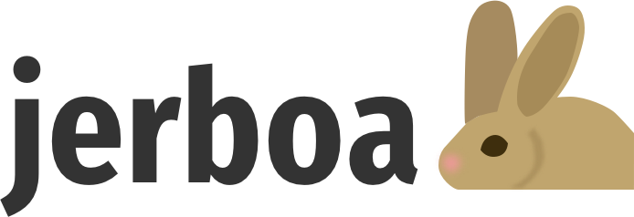
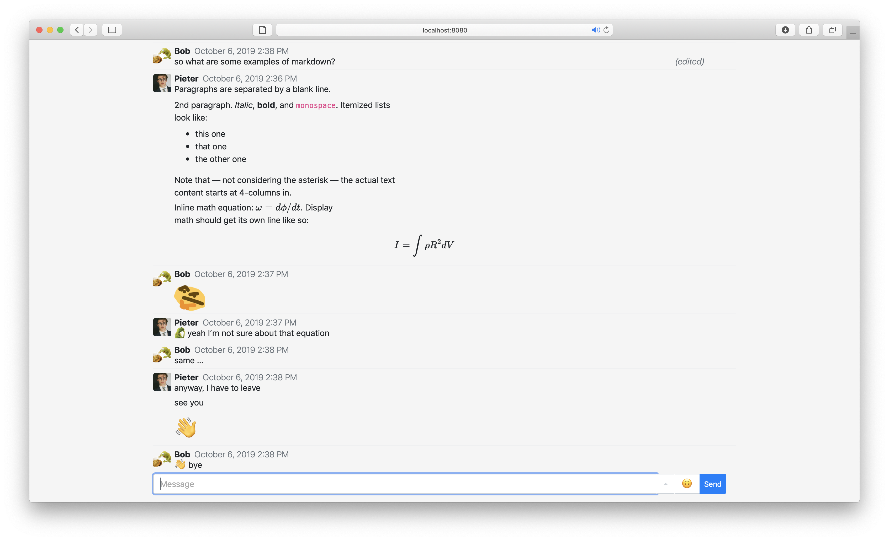
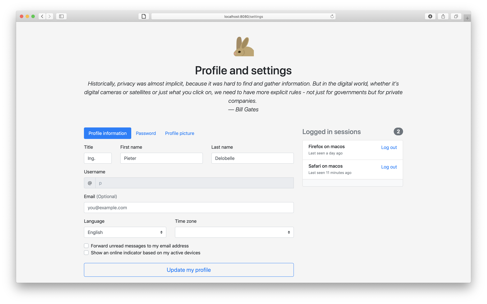

 
    
 

A **self-deployable chat application** built on the idea that your messages should be yours to manage. It features:

- Custom emoji
- File sharing
- Image sharing
- Message editing
- Markdown support in messages, even tables!
- Math rendering with [KaTeX](https://katex.org)
- User control over login sessions
- Dark-mode support, it even follows system dark-mode (at least on macOS)
- Small indication when other users are typing
- Preview PDF files in the browser side-by-side with the chat

# Screenshots

# Future development and contributing

In short, our future plans for this project is to make a complete chat application. For detailed targets, take a look at the project boards on this repo. Feel free to implement something and send a pull request!

Our technology stack is as follows:

- **Database**: We use Postgres with Yoyo for database migrations. The migrations are stored in the `migrations/` folder.
- **Backend**: A simple Flask server in Python. For websockets support we use gevent.
- **Frontend**: Vuejs with Bootstrap and some custom styles.
